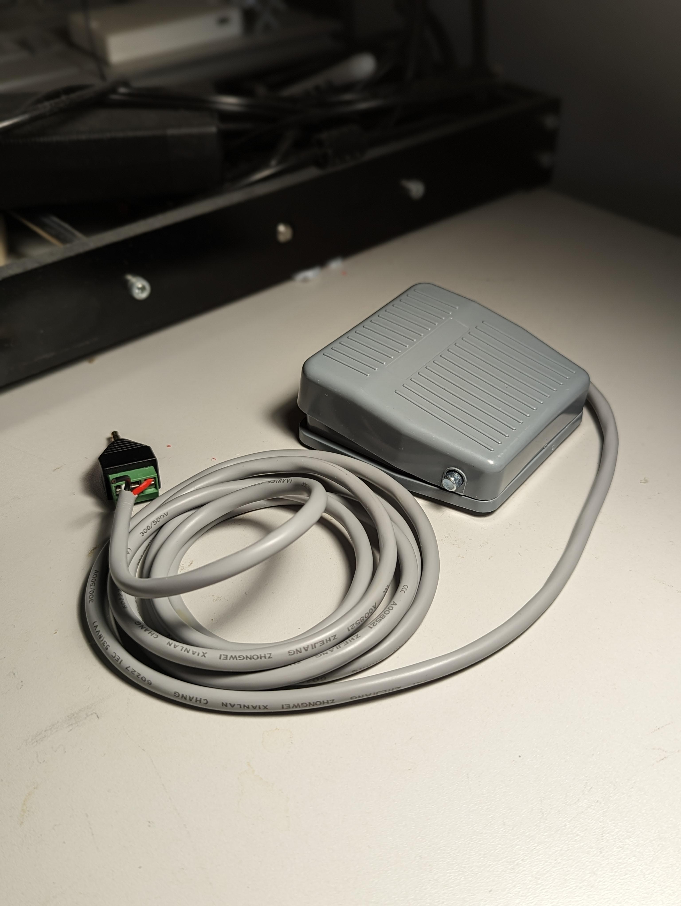

# Foot Pedal Switch
The Foot Pedal Switch is an assistive switch with a standard 3.5 mm mono jack that can be operated with a foot.

This design is by John Park and was posted as part of an Adafruit Learning guide (https://learn.adafruit.com/diy-adaptive-game-controllers/interfacing-buttons-and-switches#foot-pedal-3015364-27).

## More info at
- [Makers Making Change Project Page](https://makersmakingchange.com/project/foot-pedal-switch/)

Foot Pedal Switch
### 1. Do it Yourself (DIY) or Do it Together (DIT)

This is an open-source assistive technology, so anyone is free to build it. All of the files and instructions required to build the Foot Pedal Switch are contained within this repository. Refer to the Maker Checklist below.

### 2. Request a build of this device

If you would like to obtain a Foot Pedal Switch, you may submit a build request through the [MMC Library Page](https://makersmakingchange.com/project/foot-pedal-switch/). The requestor is responsible for the cost of materials and any shipping.

### 3. How to build this device for someone else

If you have the skills and equipment to build this device, and would like to donate your time to create the switch for someone who needs it, visit the [MMC Maker Wanted](https://makersmakingchange.com/maker-wanted/) section.

## Getting Started

### 1. Read the Makers Checklist

The Makers Checklist contains a list of steps outling the process to create the device.

### 2. Order the Off-The-Shelf Components

The [Bill of Materials](/Documentation/Foot_Pedal_Switch_BOM_V1.0.xlsx) lists all of the parts and components required to build the Foot Pedal Switch. The all components needs to be ordered online. 

### 3. Assemble the Foot Pedal Switch

Reference the [Assembly Guide](/Documentation/Foot_Pedal_Switch_Assembly_Guide_V1.0.pdf) for the tools and steps required to build each portion.

## Files
### Documentation
| Document             | Version | Link |
|----------------------|---------|------|
| Design Rationale     | 1.2     | [Foot_Pedal_Switch_Design_Rationale](/Documentation/Foot_Pedal_Switch_Design_Rationale_V1.2.pdf)     |
| Maker Checklist      | 1.2     | [Foot_Pedal_Switch_Maker_Checklist](/Documentation/Foot_Pedal_Switch_Maker_Checklist_V1.2.pdf)     |
| Bill of Materials    | 1.2     | [Foot_Pedal_Switch_Bill_of_Materials](/Documentation/Foot_Pedal_Switch_BOM_V1.2.xlsx)     |
| Assembly Guide       | 1.2     | [Foot_Pedal_Switch_Assembly_Guide](/Documentation/Foot_Pedal_Switch_Assembly_Guide_V1.2.pdf)     |
| 3D Printing Guide    | 1.2     | [Pill_Splitter_3D_Printing_Guide](/Documentation/Pill_Splitter_3D_Printing_Guide_V1.2.pdf)     |
| User Guide           | 1.2     | [Foot_Pedal_Switch_User_Guide](/Documentation/Foot_Pedal_Switch_User_Guide_V1.2.pdf)    |
| Changelog            | 1.2     | [Foot_Pedal_Switch_Changelog](/Documentation/Foot_Pedal_Switch_Changelog_V1.2.pdf)     |

### Design Files
 - [CAD Files](/Design_Files)

### Build Files
 - [3D Printing Files](/Build_Files/3D_Printing_Files)

## Attribution
 - Design by [John Park](https://learn.adafruit.com/diy-adaptive-game-controllers/interfacing-buttons-and-switches#foot-pedal-3015364-27)
 - Documentation by Neil Squire Society/Makers Making Change

## License
Everything needed or used to design, make, test, or prepare the Foot Pedal Switch is licensed under the [Creative Commons Attribution-NonCommercial-ShareAlike 4.0 ](https://creativecommons.org/licenses/by-nc-sa/4.0/).

Accompanying material such as instruction manuals, videos, and other copyrightable works that are useful but not necessary to design, make, test, or prepare the Foot Pedal Switch are published under a Creative Commons Attribution-ShareAlike 4.0 license https://creativecommons.org/licenses/by-sa/4.0/ (CC BY-SA 4.0).

---
<!-- ABOUT MMC START -->
## About Makers Making Change

Makers Making Change is an initiative of [Neil Squire](https://www.neilsquire.ca/), a Canadian non-profit that helps people with disabilities.

We are committed to creating a network of volunteer makers who support people with disabilities in their communities through 3D printing assistive devices. Check out our library of free, open-source assistive technologies with parts and build instructions.

 - Website: [www.MakersMakingChange.com](https://www.makersmakingchange.com/)
 - GitHub: [https://github.com/makersmakingchange](https://github.com/makersmakingchange)
 - Twitter: [@makermakechange](https://twitter.com/makermakechange)
 - Instagram: [@makersmakingchange](https://www.instagram.com/makersmakingchange)

## Contact Us

For technical questions, to get involved, or share your experience we encourage you to visit the [MMC Website](https://www.makersmakingchange.com/), [MMC Forum](https://makersmakingchange.com/forum), or contact info@makersmakingchange.com
<!-- ABOUT MMC END -->
